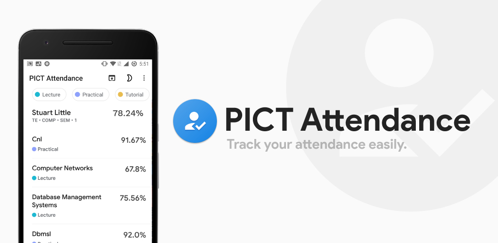
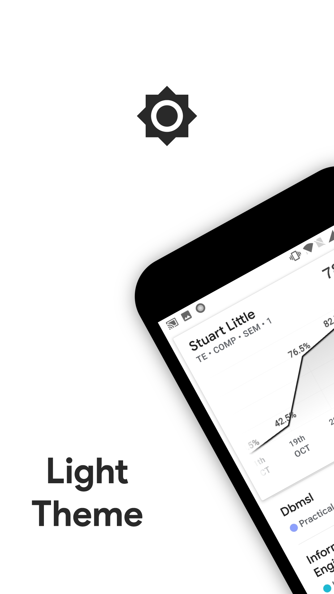
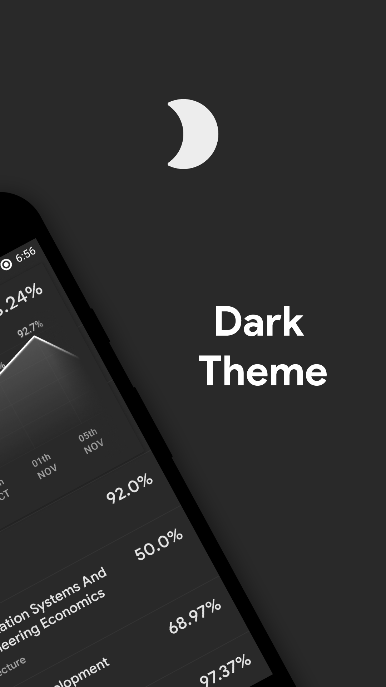
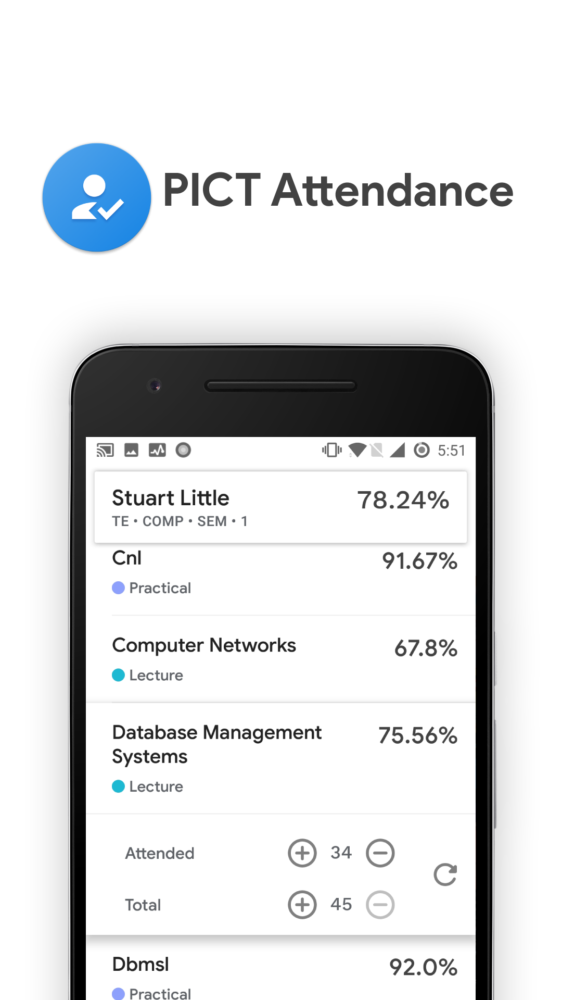
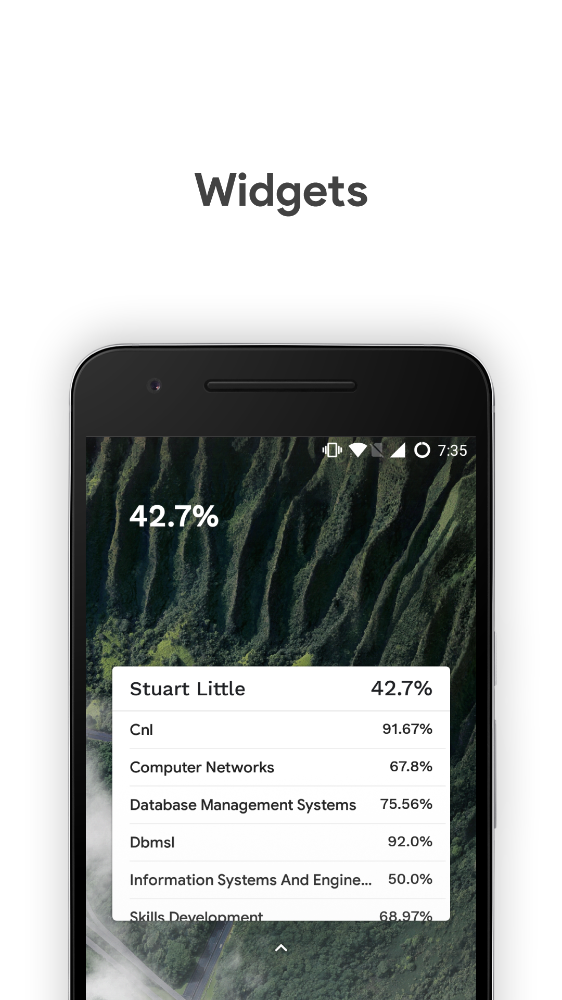

# PICTAttendance

Attendance tracking app for PICT college students.

  

## About
- An android app for PICT college students to track their attendance.
- Lets you check your attendance beforehand in case you want to bunk a lecture ;)
- Attendance is stored offline
- Option to update the attendance after every specified amount of time.
- Dark and light widgets
- Users can view their previous attendance
- Dark and light theme
- View graph of your attendance

<table style="width:100%">
  <tr>
    <td></td>
    <td></td>
    <td></td>
    <td></td>
  </tr>
</table>

## Download

<a href='https://play.google.com/store/apps/details?id=com.piyush.pictattendance'>
	
